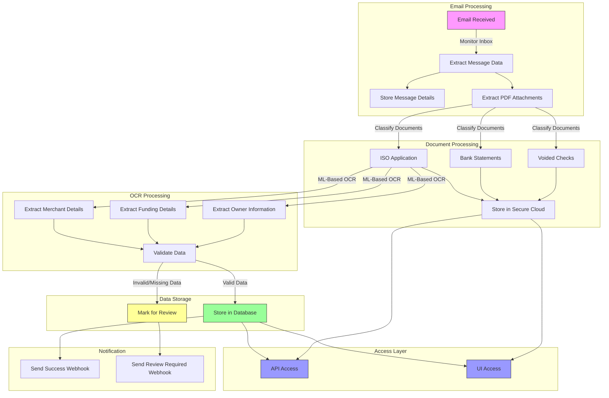
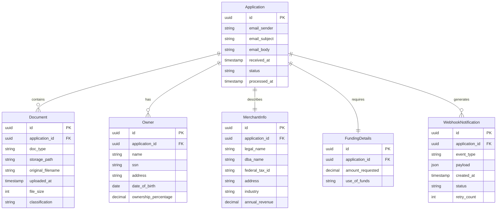
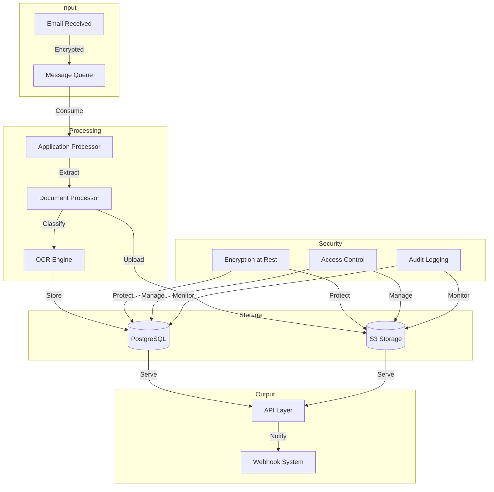
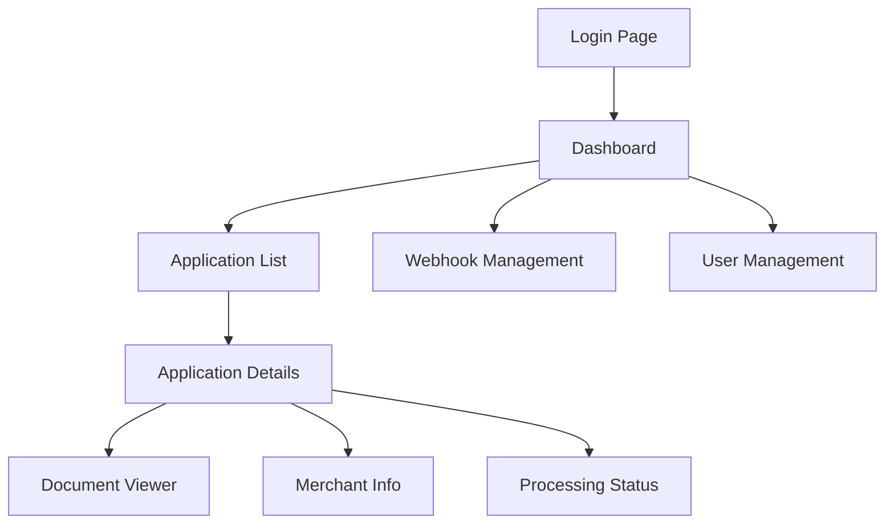
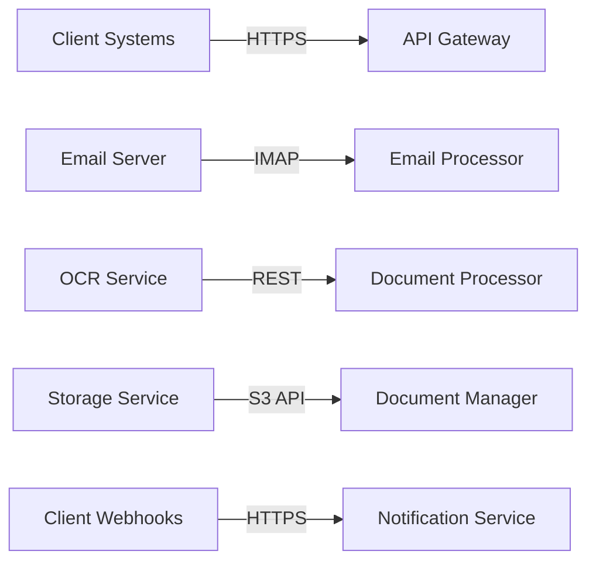

# Product Requirements Document (PRD)

# 1. INTRODUCTION

## 1.1 PURPOSE
This Software Requirements Specification (SRS) document provides a comprehensive description of the Dollar Funding MCA Application Processing System. It details the functional and non-functional requirements for the development team, project stakeholders, and system architects. The document serves as the primary reference for technical implementation and validation of the delivered system.

## 1.2 SCOPE
The Dollar Funding MCA Application Processing System is a cloud-based solution designed to automate the processing of Merchant Cash Advance applications. The system will:

- Monitor and process incoming emails at submissions@dollarfunding.com
- Extract and classify PDF attachments (ISO applications, bank statements, voided checks)
- Perform intelligent OCR on application documents to extract merchant, funding, and owner information
- Store processed applications and attachments in secure cloud storage
- Provide webhook notifications for application status updates
- Offer both API and UI interfaces for system interaction

Key benefits include:
- Reduction in manual data entry workforce from 28 to 2 employees
- Improved accuracy through specialized OCR processing
- Faster application processing turnaround
- Secure and compliant document storage
- Scalable infrastructure to handle varying workloads
- High availability for business-critical operations

The system will not include:
- Processing of non-PDF documents
- Direct integration with underwriting systems
- Modification of existing broker submission processes
- Financial transaction processing

# 2. PRODUCT DESCRIPTION

## 2.1 PRODUCT PERSPECTIVE
The Dollar Funding MCA Application Processing System operates as a standalone cloud-based service that interfaces with existing email infrastructure and Dollar Funding's internal systems. The system fits into the larger MCA processing workflow as follows:

```mermaid
graph TD
    A[Broker] -->|Emails Application| B[submissions@dollarfunding.com]
    B -->|Triggers| C[Processing System]
    C -->|Stores Data| D[Cloud Database]
    C -->|Stores Files| E[Secure Storage]
    C -->|Notifies| F[Dollar Funding Systems]
    F -->|Access via| G[API/UI Interface]
    F -->|Notifications| H[Webhooks]
```

## 2.2 PRODUCT FUNCTIONS
- Email Monitoring and Processing
  - Continuous monitoring of submissions@dollarfunding.com
  - Extraction of email metadata and attachments
  - Status tracking of application processing

- Document Management
  - PDF attachment classification
  - Secure cloud storage with access controls
  - Document retrieval via API/UI

- Intelligent OCR Processing
  - Machine learning-based text extraction
  - Support for handwritten text
  - Handling of poor-quality scans
  - Structured data extraction for:
    - Merchant information
    - Funding details
    - Owner information

- Integration Services
  - RESTful API endpoints
  - Webhook notification system
  - Web-based user interface

## 2.3 USER CHARACTERISTICS

| User Type | Description | Technical Expertise | System Usage |
|-----------|-------------|---------------------|--------------|
| Data Entry Staff | Remaining team members handling exceptions | Moderate | Daily use of UI for manual review |
| System Administrators | IT staff managing integrations | High | API/webhook configuration |
| Business Analysts | Staff monitoring processing metrics | Moderate | Regular UI access for reporting |
| External Brokers | Submit applications via email | Low | Indirect interaction via email |

## 2.4 CONSTRAINTS
1. Technical Constraints
   - Must process PDF documents only
   - Must maintain 99.9% system availability
   - Must process applications within 5 minutes
   - Must support concurrent processing of multiple applications

2. Security Constraints
   - Must comply with PCI DSS for handling sensitive data
   - Must implement role-based access control
   - Must encrypt data at rest and in transit
   - Must maintain audit logs of all system access

3. Regulatory Constraints
   - Must comply with GDPR and CCPA data privacy requirements
   - Must maintain records for regulatory audits
   - Must implement data retention policies

4. Business Constraints
   - Must achieve 95% accuracy in data extraction
   - Must support processing volume of 1000 applications per day
   - Must integrate with existing email infrastructure

## 2.5 ASSUMPTIONS AND DEPENDENCIES
### Assumptions
- Email server will remain accessible and operational
- PDF documents will contain required information
- Brokers will continue submitting applications via email
- Network connectivity will be maintained for cloud services

### Dependencies
- Cloud infrastructure availability
- Email service provider uptime
- Third-party OCR service reliability
- Integration API availability
- Database service performance
- Storage service capacity
- Network bandwidth and latency

# 3. PROCESS FLOWCHART



# 4. FUNCTIONAL REQUIREMENTS

## 4.1 Email Processing (EP)

### ID: EP-01
**Description**: Monitor submissions@dollarfunding.com inbox  
**Priority**: High  

| Requirement ID | Requirement Description | Acceptance Criteria |
|---------------|------------------------|-------------------|
| EP-01-01 | System shall continuously monitor the designated email inbox | - Email monitoring service uptime > 99.9%<br>- Maximum delay in email detection < 30 seconds |
| EP-01-02 | System shall handle email server connection interruptions | - Automatic reconnection attempts<br>- Alert notifications for persistent connection issues |
| EP-01-03 | System shall support concurrent email processing | - Process minimum 50 emails simultaneously<br>- No email processing queue delay > 2 minutes |

### ID: EP-02
**Description**: Extract and store email metadata  
**Priority**: High  

| Requirement ID | Requirement Description | Acceptance Criteria |
|---------------|------------------------|-------------------|
| EP-02-01 | System shall extract email sender information | - Capture sender email address<br>- Capture sender name if available |
| EP-02-02 | System shall extract email subject and body | - Store complete email content<br>- Maintain original formatting |
| EP-02-03 | System shall store email receipt timestamp | - UTC timestamp format<br>- Millisecond precision |

## 4.2 Document Management (DM)

### ID: DM-01
**Description**: PDF Attachment Processing  
**Priority**: High  

| Requirement ID | Requirement Description | Acceptance Criteria |
|---------------|------------------------|-------------------|
| DM-01-01 | System shall extract all PDF attachments | - Support multiple attachments per email<br>- Validate PDF format integrity |
| DM-01-02 | System shall classify PDF documents | - Identify ISO applications<br>- Identify bank statements<br>- Identify voided checks |
| DM-01-03 | System shall handle corrupt or invalid PDFs | - Generate error notification<br>- Log document issues |

### ID: DM-02
**Description**: Secure Document Storage  
**Priority**: High  

| Requirement ID | Requirement Description | Acceptance Criteria |
|---------------|------------------------|-------------------|
| DM-02-01 | System shall store documents in encrypted cloud storage | - AES-256 encryption<br>- Secure access controls |
| DM-02-02 | System shall maintain document metadata | - Document type<br>- Upload timestamp<br>- Original filename |
| DM-02-03 | System shall support document retrieval | - Secure download links<br>- Access logging |

## 4.3 OCR Processing (OCR)

### ID: OCR-01
**Description**: Intelligent Text Extraction  
**Priority**: High  

| Requirement ID | Requirement Description | Acceptance Criteria |
|---------------|------------------------|-------------------|
| OCR-01-01 | System shall extract merchant details | - Business legal name<br>- DBA name<br>- Federal Tax ID/EIN<br>- Address<br>- Industry<br>- Revenue |
| OCR-01-02 | System shall extract funding details | - Funding amount requested<br>- Use of funds description |
| OCR-01-03 | System shall extract owner information | - Name<br>- SSN<br>- Address<br>- Date of Birth<br>- Ownership percentage |

### ID: OCR-02
**Description**: Advanced OCR Capabilities  
**Priority**: High  

| Requirement ID | Requirement Description | Acceptance Criteria |
|---------------|------------------------|-------------------|
| OCR-02-01 | System shall process handwritten text | - 90% accuracy for clear handwriting<br>- Flag unclear handwriting for review |
| OCR-02-02 | System shall handle poor quality scans | - Process documents up to 200 DPI<br>- Support skewed documents up to 30 degrees |
| OCR-02-03 | System shall validate extracted data | - Check for required fields<br>- Validate data formats |

## 4.4 Integration Services (IS)

### ID: IS-01
**Description**: API Implementation  
**Priority**: High  

| Requirement ID | Requirement Description | Acceptance Criteria |
|---------------|------------------------|-------------------|
| IS-01-01 | System shall provide RESTful API endpoints | - OpenAPI/Swagger documentation<br>- Standard HTTP methods |
| IS-01-02 | System shall implement authentication | - JWT-based authentication<br>- API key support |
| IS-01-03 | System shall support document download | - Secure download URLs<br>- Rate limiting |

### ID: IS-02
**Description**: Webhook Management  
**Priority**: High  

| Requirement ID | Requirement Description | Acceptance Criteria |
|---------------|------------------------|-------------------|
| IS-02-01 | System shall support webhook registration | - Multiple webhook endpoints<br>- Endpoint validation |
| IS-02-02 | System shall send webhook notifications | - Application processed events<br>- Review required events |
| IS-02-03 | System shall handle webhook failures | - Retry mechanism<br>- Failure logging |

## 4.5 User Interface (UI)

### ID: UI-01
**Description**: Web Interface Implementation  
**Priority**: Medium  

| Requirement ID | Requirement Description | Acceptance Criteria |
|---------------|------------------------|-------------------|
| UI-01-01 | System shall display application information | - Merchant details view<br>- Document preview<br>- Processing status |
| UI-01-02 | System shall provide webhook management | - Add/edit/delete webhooks<br>- View webhook history |
| UI-01-03 | System shall support user management | - Role-based access control<br>- User activity logging |

# 5. NON-FUNCTIONAL REQUIREMENTS

## 5.1 Performance Requirements

| Category | Requirement | Target Metric |
|----------|-------------|---------------|
| Response Time | Email processing initiation | < 30 seconds from receipt |
| | Document classification | < 60 seconds per document |
| | OCR processing | < 180 seconds per application |
| | API response time | < 500ms for 95th percentile |
| Throughput | Concurrent email processing | 50 simultaneous emails |
| | Daily application capacity | 1,000 applications |
| | API requests | 100 requests per second |
| Resource Usage | CPU utilization | < 80% under peak load |
| | Memory usage | < 85% of allocated memory |
| | Storage IOPS | < 5000 IOPS per instance |

## 5.2 Safety Requirements

| Requirement | Description |
|-------------|-------------|
| Data Backup | - Automated daily backups with 30-day retention |
| | - Cross-region backup replication |
| | - 15-minute RPO (Recovery Point Objective) |
| Failure Recovery | - Automatic failover to standby systems |
| | - 1-hour RTO (Recovery Time Objective) |
| | - Automated system health monitoring |
| Error Handling | - Graceful degradation of services |
| | - Comprehensive error logging |
| | - Automated error notifications |

## 5.3 Security Requirements

| Category | Requirement |
|----------|-------------|
| Authentication | - Multi-factor authentication for UI access |
| | - JWT-based API authentication |
| | - Session timeout after 15 minutes of inactivity |
| Authorization | - Role-based access control (RBAC) |
| | - Principle of least privilege |
| | - Regular access review requirements |
| Data Protection | - AES-256 encryption for data at rest |
| | - TLS 1.3 for data in transit |
| | - Secure key management system |
| Audit | - Comprehensive audit logging |
| | - Tamper-proof audit trails |
| | - 12-month audit log retention |

## 5.4 Quality Requirements

### 5.4.1 Availability
- System uptime: 99.9% (excluding planned maintenance)
- Planned maintenance windows: Outside business hours (EST)
- Maximum unplanned downtime: 43.2 minutes/month

### 5.4.2 Maintainability
- Modular architecture with loose coupling
- Comprehensive API documentation
- Automated deployment processes
- Code coverage minimum: 80%

### 5.4.3 Usability
- Web interface compatible with latest versions of Chrome, Firefox, Safari
- Maximum page load time: 3 seconds
- Responsive design for desktop and tablet
- Accessibility compliance with WCAG 2.1 Level AA

### 5.4.4 Scalability
- Horizontal scaling capability
- Auto-scaling based on CPU utilization (trigger at 70%)
- Database partitioning for performance
- Load balancing across multiple availability zones

### 5.4.5 Reliability
- Fault tolerance through redundancy
- Automatic failover capabilities
- Data consistency checks
- Zero data loss guarantee for processed applications

## 5.5 Compliance Requirements

| Requirement Type | Specifications |
|-----------------|----------------|
| Data Privacy | - GDPR compliance for EU data subjects |
| | - CCPA compliance for California residents |
| | - Data retention policies enforcement |
| Security Standards | - PCI DSS compliance for payment data |
| | - SOC 2 Type II certification |
| | - ISO 27001 alignment |
| Document Management | - SEC 17a-4 compliant storage |
| | - Digital signature compliance |
| | - Audit trail requirements |
| Industry Specific | - Financial services regulatory compliance |
| | - State-specific lending regulations |
| | - Anti-money laundering (AML) requirements |

# 6. DATA REQUIREMENTS

## 6.1 DATA MODELS



## 6.2 DATA STORAGE

### 6.2.1 Database Requirements
- Primary Database: PostgreSQL 14+ for structured data
- Document Store: Amazon S3 for PDF storage
- Cache Layer: Redis for performance optimization

### 6.2.2 Storage Specifications
| Data Type | Storage Location | Retention Period | Backup Frequency |
|-----------|-----------------|------------------|------------------|
| Application Data | PostgreSQL | 7 years | Daily |
| PDF Documents | S3 | 7 years | Daily |
| Webhook Logs | PostgreSQL | 1 year | Daily |
| Audit Trails | PostgreSQL | 7 years | Daily |
| Cache Data | Redis | 24 hours | N/A |

### 6.2.3 Backup and Recovery
- Daily automated backups with point-in-time recovery
- Cross-region replication for disaster recovery
- 30-day backup retention for immediate recovery
- 7-year cold storage archival for compliance
- 15-minute RPO (Recovery Point Objective)
- Automated backup testing monthly

## 6.3 DATA PROCESSING



### 6.3.1 Data Security Controls
- Encryption at rest using AES-256
- TLS 1.3 for data in transit
- Row-level security in PostgreSQL
- S3 server-side encryption
- Key rotation every 90 days
- Data masking for sensitive fields (SSN, Tax ID)

### 6.3.2 Data Validation Rules
| Field | Validation Rule |
|-------|----------------|
| SSN | 9 digits, valid format check |
| Federal Tax ID | 9 digits, valid EIN format |
| Email | RFC 5322 compliance |
| Phone Numbers | E.164 format |
| Currency Values | 2 decimal precision |
| Dates | ISO 8601 format |
| Ownership Percentage | 0-100 range, sum ≤ 100 |

### 6.3.3 Data Archival Strategy
- Monthly archival of processed applications
- Compressed storage format for archives
- Searchable index of archived data
- Automated archive verification
- Compliance metadata tagging
- Legal hold capability

# 7. EXTERNAL INTERFACES

## 7.1 USER INTERFACES

### 7.1.1 Web Application Interface



| Screen | Key Components | Requirements |
|--------|---------------|--------------|
| Dashboard | - Application status summary<br>- Processing metrics<br>- Recent activity feed | - Real-time updates<br>- Responsive layout<br>- Data visualization |
| Application List | - Sortable/filterable grid<br>- Search functionality<br>- Bulk actions | - Pagination<br>- Column customization<br>- Export capability |
| Application Details | - Document previewer<br>- Merchant information<br>- Owner details<br>- Processing history | - Side-by-side comparison<br>- Inline editing<br>- Version history |
| Webhook Management | - Endpoint configuration<br>- Event subscription<br>- Delivery logs | - Test functionality<br>- Status monitoring<br>- Retry controls |

### 7.1.2 Design Requirements
- Material Design 3 components
- Responsive breakpoints: 320px, 768px, 1024px, 1440px
- WCAG 2.1 Level AA compliance
- Dark/Light theme support
- Loading state indicators
- Error handling displays

## 7.2 HARDWARE INTERFACES

### 7.2.1 Cloud Infrastructure
- AWS EC2 instances for application hosting
- Load balancers for traffic distribution
- Auto-scaling groups for demand management
- S3 storage for document management
- RDS instances for database operations

### 7.2.2 Network Requirements
| Component | Specification |
|-----------|--------------|
| Network Bandwidth | Minimum 1Gbps |
| Load Balancer | Application Load Balancer (ALB) |
| CDN | CloudFront distribution |
| VPC Configuration | Multi-AZ deployment |

## 7.3 SOFTWARE INTERFACES

### 7.3.1 External Services Integration

| Service | Interface Type | Purpose |
|---------|---------------|----------|
| Email Service | IMAP/SMTP | Email monitoring and processing |
| OCR Service | REST API | Document text extraction |
| Storage Service | S3 API | Document storage and retrieval |
| Database | PostgreSQL | Data persistence |
| Cache | Redis API | Performance optimization |

### 7.3.2 API Specifications

```yaml
openapi: 3.0.0
paths:
  /applications:
    get:
      summary: List applications
    post:
      summary: Create application
  /applications/{id}:
    get:
      summary: Get application details
  /documents/{id}:
    get:
      summary: Download document
  /webhooks:
    get:
      summary: List webhooks
    post:
      summary: Register webhook
```

## 7.4 COMMUNICATION INTERFACES

### 7.4.1 Network Protocols
- HTTPS (TLS 1.3) for all API communication
- WebSocket for real-time updates
- SMTP/IMAP for email processing
- SNS/SQS for internal messaging

### 7.4.2 Data Exchange Formats

| Interface | Format | Schema |
|-----------|--------|---------|
| REST API | JSON | OpenAPI 3.0 |
| Webhooks | JSON | Custom Event Schema |
| Email Processing | MIME | RFC 5322 |
| File Transfer | Binary | PDF/A-1b |

### 7.4.3 Integration Points



# 8. APPENDICES

## 8.1 GLOSSARY

| Term | Definition |
|------|------------|
| Merchant Cash Advance (MCA) | A type of business financing where a company purchases a portion of a merchant's future credit card sales for a discount |
| ISO Application | Independent Sales Organization application form used to collect merchant information for MCA funding |
| Voided Check | A business check marked as void, used to verify bank account information |
| Bank Statement | Monthly record of banking transactions used to verify business revenue |
| Webhook | HTTP callback that delivers data to other applications in real-time |
| OCR | Optical Character Recognition, technology that converts different types of documents into machine-readable text |

## 8.2 ACRONYMS

| Acronym | Definition |
|---------|------------|
| API | Application Programming Interface |
| DBA | Doing Business As |
| EIN | Employer Identification Number |
| GDPR | General Data Protection Regulation |
| CCPA | California Consumer Privacy Act |
| SSN | Social Security Number |
| JWT | JSON Web Token |
| IMAP | Internet Message Access Protocol |
| SMTP | Simple Mail Transfer Protocol |
| RBAC | Role-Based Access Control |
| RPO | Recovery Point Objective |
| RTO | Recovery Time Objective |
| UI | User Interface |
| WCAG | Web Content Accessibility Guidelines |
| AML | Anti-Money Laundering |

## 8.3 ADDITIONAL REFERENCES

| Reference | Description | URL/Location |
|-----------|-------------|--------------|
| AWS S3 Documentation | Reference for secure document storage implementation | https://docs.aws.amazon.com/s3/ |
| PostgreSQL Documentation | Database implementation reference | https://www.postgresql.org/docs/ |
| Redis Documentation | Caching implementation reference | https://redis.io/documentation |
| OpenAPI Specification | API documentation standard | https://swagger.io/specification/ |
| Material Design 3 | UI design system reference | https://m3.material.io/ |
| RFC 5322 | Email format specification | https://tools.ietf.org/html/rfc5322 |
| PCI DSS Requirements | Payment Card Industry Data Security Standard | https://www.pcisecuritystandards.org/ |
| JWT RFC 7519 | JSON Web Token standard | https://tools.ietf.org/html/rfc7519 |