# Technical Specification

# 1. INTRODUCTION

## 1.1 Executive Summary

The MFE (MATLAB Financial Econometrics) Toolbox is a sophisticated MATLAB-based software suite designed to provide comprehensive tools for financial time series modeling, econometric analysis, and risk assessment. Version 4.0, released on October 28, 2009, represents a significant advancement in the field of quantitative finance and econometrics.

### Business Problem
The toolbox addresses critical challenges in financial and economic analysis:
- Complex financial time series modeling requiring robust statistical frameworks
- Need for high-performance econometric computations in research and production environments
- Demand for sophisticated risk modeling and cross-sectional analysis capabilities
- Requirements for processing and analyzing high-frequency financial data
- Integration of advanced statistical methods with user-friendly interfaces

### Key Stakeholders
- Financial Analysts: Primary users requiring tools for market analysis and risk assessment
- Econometricians: Researchers and practitioners conducting statistical analysis
- Risk Managers: Professionals monitoring and evaluating financial risk metrics
- Academic Researchers: Scholars conducting quantitative financial research
- MATLAB Platform Users: Technical users integrating with existing MATLAB workflows

### Value Proposition
The MFE Toolbox delivers substantial business value through:
- Accelerated Analysis: High-performance computing via MEX integration
- Reduced Development Time: Pre-built, validated statistical routines
- Enhanced Accuracy: Robust error checking and validation mechanisms
- Flexible Integration: Seamless compatibility with MATLAB ecosystem
- Research to Production: Support for both research prototyping and production deployment

## 1.2 System Overview

### Project Context

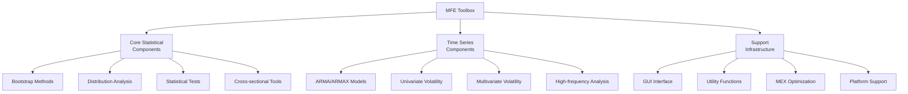
```mermaid
flowchart TB
A[MFE Toolbox] --> B[Core Statistical<br/>Components]
A --> C[Time Series<br/>Components]
A --> D[Support<br/>Infrastructure]

B --> B1[Bootstrap Methods]
B --> B2[Distribution Analysis]
B --> B3[Statistical Tests]
B --> B4[Cross-sectional Tools]

C --> C1[ARMA/ARMAX Models]
C --> C2[Univariate Volatility]
C --> C3[Multivariate Volatility]
C --> C4[High-frequency Analysis]

D --> D1[GUI Interface]
D --> D2[Utility Functions]
D --> D3[MEX Optimization]
D --> D4[Platform Support]
```

#### Business Context
- Positions as a comprehensive MATLAB extension for financial econometrics
- Targets both academic research and industry applications
- Focuses on high-performance statistical computing
- Emphasizes robustness and reliability in financial analysis

#### Current System Architecture
The system is organized into three primary component groups:

1. Core Statistical Modules:
   - Bootstrap: Robust resampling techniques
   - Distributions: Statistical distribution computations
   - Tests: Comprehensive statistical testing suite
   - Cross-section: Analysis tools for sectional data

2. Time Series Components:
   - ARMA/ARMAX modeling and forecasting
   - Univariate and multivariate volatility models
   - High-frequency econometric analysis
   - Advanced risk metrics computation

3. Support Infrastructure:
   - Interactive GUI for ARMAX modeling
   - Utility functions for data manipulation
   - MEX-based performance optimization
   - Cross-platform compatibility layer

### Key Technical Decisions
1. Performance Optimization:
   - Implementation of critical components in C via MEX
   - Optimized matrix operations for large datasets
   - Platform-specific performance enhancements

2. Architecture Design:
   - Modular component structure
   - Clear separation of concerns
   - Robust error handling mechanisms
   - Extensible framework design

3. Integration Strategy:
   - Native MATLAB function compatibility
   - MEX interface for C components
   - Standardized data structures
   - Consistent API design

## 1.3 Success Criteria

### Measurable Objectives
1. Performance Metrics:
   - MEX optimization achieving >50% performance improvement
   - Support for large-scale dataset processing
   - Efficient memory utilization in matrix operations

2. Reliability Metrics:
   - Comprehensive error handling coverage
   - Robust input validation mechanisms
   - Consistent numerical stability

3. Usability Metrics:
   - Intuitive API design
   - Comprehensive documentation
   - Clear example implementations

### Critical Success Factors
- Seamless MATLAB integration
- Robust statistical implementations
- High-performance computing capability
- Cross-platform compatibility
- Comprehensive documentation and support

## 1.4 Scope

### In-Scope Elements

#### Core Features
1. Statistical Analysis:
   - Distribution analysis and testing
   - Bootstrap methods implementation
   - Cross-sectional analysis tools
   - Statistical hypothesis testing

2. Time Series Analysis:
   - ARMA/ARMAX modeling
   - Volatility model estimation
   - High-frequency data processing
   - Risk metrics computation

3. Technical Implementation:
   - MEX optimization framework
   - GUI interface for ARMAX
   - Utility function library
   - Cross-platform support

### Out-of-Scope Elements

1. External Integrations:
   - Real-time market data feeds
   - Database connectivity
   - Third-party API integration
   - Custom data formats

2. Additional Features:
   - GUI for all functions (limited to ARMAX)
   - Non-MATLAB implementations
   - Direct market data integration
   - Custom visualization tools

3. Future Considerations:
   - Real-time processing capabilities
   - Distributed computing support
   - Cloud deployment options
   - Mobile platform support

# 2. PRODUCT REQUIREMENTS

## 2.1 FEATURE CATALOG

### Statistical Analysis Core (F-100 Series)

#### F-101: Distribution Analysis Engine
- **Feature Metadata**
  * Feature Name: Statistical Distribution Computation Engine
  * Feature Category: Core Statistical Analysis
  * Priority Level: Critical
  * Status: Completed

- **Description**
  * Overview: Comprehensive implementation of statistical distribution functions including GED, Hansen's skewed T, and standardized Student's T distributions
  * Business Value: Enables accurate risk assessment and statistical inference
  * User Benefits: Provides robust distribution analysis tools for financial modeling
  * Technical Context: Leverages MATLAB Statistics Toolbox with custom implementations

- **Dependencies**
  * Prerequisite Features: None
  * System Dependencies: MATLAB Statistics Toolbox
  * External Dependencies: None
  * Integration Requirements: Core MATLAB numerical functions

#### F-102: Bootstrap Framework
- **Feature Metadata**
  * Feature Name: Advanced Bootstrap Methods
  * Feature Category: Core Statistical Analysis
  * Priority Level: High
  * Status: Completed

- **Description**
  * Overview: Implementation of block and stationary bootstrap methods for dependent time series
  * Business Value: Enables robust statistical inference for financial time series
  * User Benefits: Provides resampling methods for risk assessment
  * Technical Context: Custom implementation with circular block and stationary approaches

- **Dependencies**
  * Prerequisite Features: F-101
  * System Dependencies: None
  * External Dependencies: None
  * Integration Requirements: Core statistical functions

### Time Series Analysis (F-200 Series)

#### F-201: ARMA/ARMAX Modeling Suite
- **Feature Metadata**
  * Feature Name: Time Series Modeling Framework
  * Feature Category: Time Series Analysis
  * Priority Level: Critical
  * Status: Completed

- **Description**
  * Overview: Comprehensive ARMA/ARMAX modeling with forecasting capabilities
  * Business Value: Enables sophisticated time series analysis and prediction
  * User Benefits: Provides tools for market analysis and forecasting
  * Technical Context: Integrates with MEX optimization for performance

- **Dependencies**
  * Prerequisite Features: F-101
  * System Dependencies: C Compiler for MEX
  * External Dependencies: None
  * Integration Requirements: MEX interface

#### F-202: Volatility Modeling Framework
- **Feature Metadata**
  * Feature Name: Advanced Volatility Models
  * Feature Category: Time Series Analysis
  * Priority Level: Critical
  * Status: Completed

- **Description**
  * Overview: Implementation of univariate and multivariate volatility models
  * Business Value: Enables sophisticated risk assessment
  * User Benefits: Provides tools for volatility forecasting and risk management
  * Technical Context: MEX-optimized core computations

- **Dependencies**
  * Prerequisite Features: F-201
  * System Dependencies: C Compiler for MEX
  * External Dependencies: None
  * Integration Requirements: MEX interface, MATLAB optimization toolbox

## 2.2 FUNCTIONAL REQUIREMENTS TABLE

### Statistical Core Requirements

| Requirement ID | Description | Acceptance Criteria | Priority | Complexity |
|---------------|-------------|-------------------|-----------|------------|
| F-101-RQ-001 | Distribution parameter estimation | Accurate estimation with numerical stability | Must-Have | High |
| F-101-RQ-002 | PDF/CDF computation | Precise probability computations | Must-Have | Medium |
| F-101-RQ-003 | Random number generation | Statistically valid samples | Must-Have | Medium |
| F-102-RQ-001 | Block bootstrap implementation | Correct block formation and sampling | Must-Have | High |
| F-102-RQ-002 | Stationary bootstrap | Proper probability-based resampling | Must-Have | High |

### Time Series Requirements

| Requirement ID | Description | Acceptance Criteria | Priority | Complexity |
|---------------|-------------|-------------------|-----------|------------|
| F-201-RQ-001 | ARMA parameter estimation | Accurate coefficient estimation | Must-Have | High |
| F-201-RQ-002 | Forecast generation | Valid multi-step forecasts | Must-Have | Medium |
| F-202-RQ-001 | GARCH model estimation | Robust parameter convergence | Must-Have | High |
| F-202-RQ-002 | Volatility forecasting | Accurate variance predictions | Must-Have | High |

## 2.3 FEATURE RELATIONSHIPS

### Dependency Map

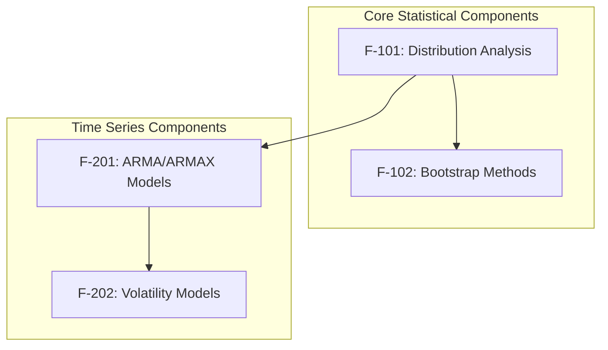
```mermaid
graph TD
    F101[F-101: Distribution Analysis] --> F102[F-102: Bootstrap Methods]
    F101 --> F201[F-201: ARMA/ARMAX Models]
    F201 --> F202[F-202: Volatility Models]
    
    subgraph "Core Statistical Components"
        F101
        F102
    end
    
    subgraph "Time Series Components"
        F201
        F202
    end
```

### Integration Points
1. Statistical Core Integration
   - Distribution functions with parameter estimation
   - Bootstrap methods with time series models
   - Error distribution integration with volatility models

2. Time Series Integration
   - ARMA/ARMAX with volatility models
   - Forecast generation with simulation methods
   - Parameter estimation with optimization routines

## 2.4 IMPLEMENTATION CONSIDERATIONS

### Technical Constraints
1. Performance Requirements
   - MEX optimization for computationally intensive operations
   - Memory efficiency for large dataset handling
   - Numerical stability in parameter estimation

2. Scalability Considerations
   - Support for large-scale time series analysis
   - Efficient matrix operations for high-dimensional data
   - Memory-optimized data structures

3. Security Implications
   - Input validation for all numerical operations
   - Memory boundary checking in MEX implementations
   - Error handling for numerical instabilities

4. Maintenance Requirements
   - Version control for MEX binaries
   - Platform-specific compilation management
   - Documentation updates for API changes

# 3. PROCESS FLOWCHART

## 3.1 Core System Workflows

### 3.1.1 System Initialization Flow

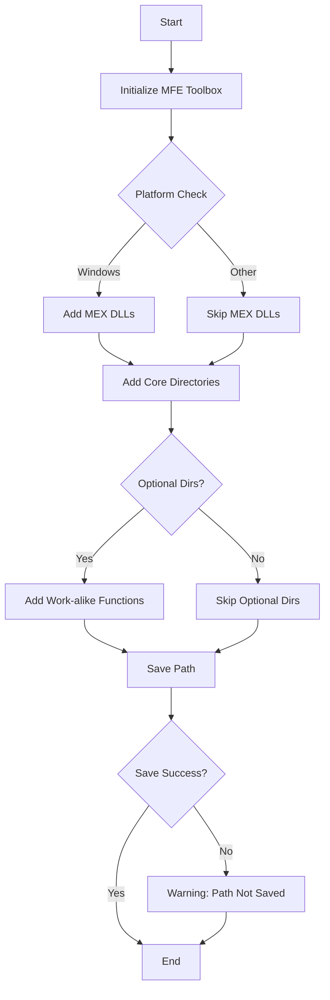
```mermaid
flowchart TD
    A[Start] --> B[Initialize MFE Toolbox]
    B --> C{Platform Check}
    C -->|Windows| D[Add MEX DLLs]
    C -->|Other| E[Skip MEX DLLs]
    D --> F[Add Core Directories]
    E --> F
    F --> G{Optional Dirs?}
    G -->|Yes| H[Add Work-alike Functions]
    G -->|No| I[Skip Optional Dirs]
    H --> J[Save Path]
    I --> J
    J --> K{Save Success?}
    K -->|Yes| L[End]
    K -->|No| M[Warning: Path Not Saved]
    M --> L
```

### 3.1.2 ARMAX Modeling Workflow

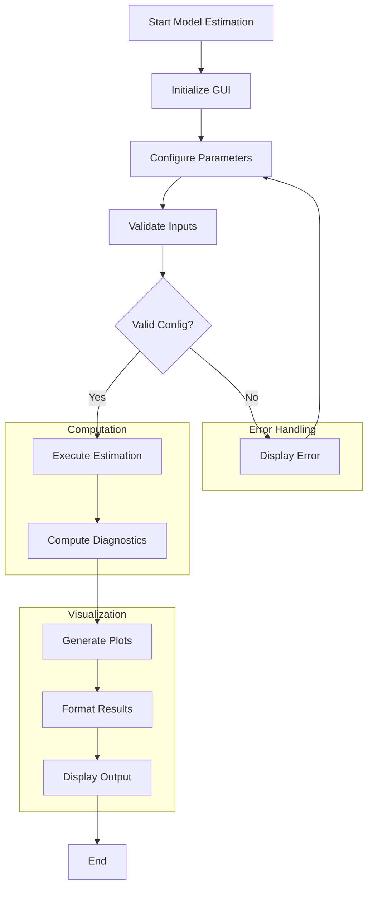
```mermaid
flowchart TD
    A[Start Model Estimation] --> B[Initialize GUI]
    B --> C[Configure Parameters]
    C --> D[Validate Inputs]
    D --> E{Valid Config?}
    E -->|No| F[Display Error]
    F --> C
    E -->|Yes| G[Execute Estimation]
    G --> H[Compute Diagnostics]
    H --> I[Generate Plots]
    I --> J[Format Results]
    J --> K[Display Output]
    K --> L[End]

    subgraph "Error Handling"
        F
    end
    
    subgraph "Computation"
        G
        H
    end
    
    subgraph "Visualization"
        I
        J
        K
    end
```

## 3.2 Statistical Processing Pipeline

### 3.2.1 Time Series Analysis Flow

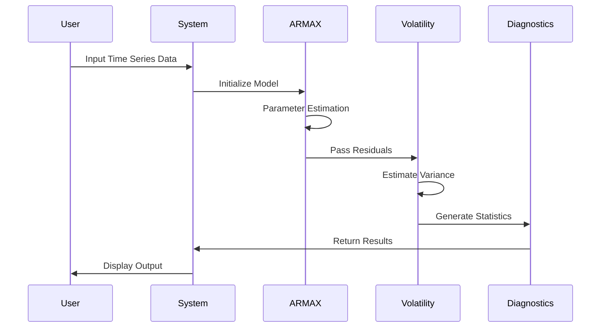
```mermaid
sequenceDiagram
    participant User
    participant System
    participant ARMAX
    participant Volatility
    participant Diagnostics

    User->>System: Input Time Series Data
    System->>ARMAX: Initialize Model
    ARMAX->>ARMAX: Parameter Estimation
    ARMAX->>Volatility: Pass Residuals
    Volatility->>Volatility: Estimate Variance
    Volatility->>Diagnostics: Generate Statistics
    Diagnostics->>System: Return Results
    System->>User: Display Output
```

### 3.2.2 High-Performance Computing Flow

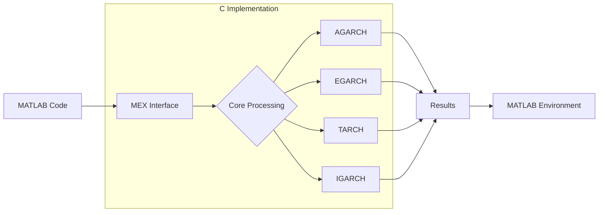
```mermaid
flowchart LR
    A[MATLAB Code] --> B[MEX Interface]
    B --> C{Core Processing}
    C --> D[AGARCH]
    C --> E[EGARCH]
    C --> F[TARCH]
    C --> G[IGARCH]
    D --> H[Results]
    E --> H
    F --> H
    G --> H
    H --> I[MATLAB Environment]

    subgraph "C Implementation"
        B
        C
        D
        E
        F
        G
    end
```

## 3.3 Error Handling and Recovery

### 3.3.1 Validation Flow

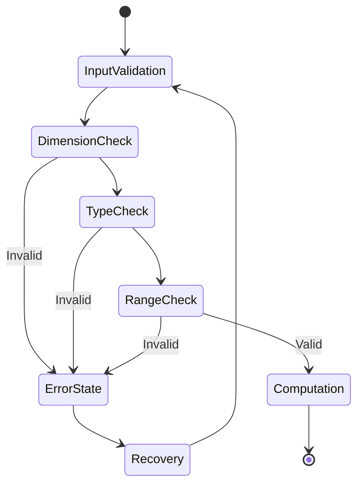
```mermaid
stateDiagram-v2
    [*] --> InputValidation
    InputValidation --> DimensionCheck
    DimensionCheck --> TypeCheck
    TypeCheck --> RangeCheck
    
    DimensionCheck --> ErrorState: Invalid
    TypeCheck --> ErrorState: Invalid
    RangeCheck --> ErrorState: Invalid
    
    RangeCheck --> Computation: Valid
    ErrorState --> Recovery
    Recovery --> InputValidation
    Computation --> [*]
```

### 3.3.2 Computational Error Management

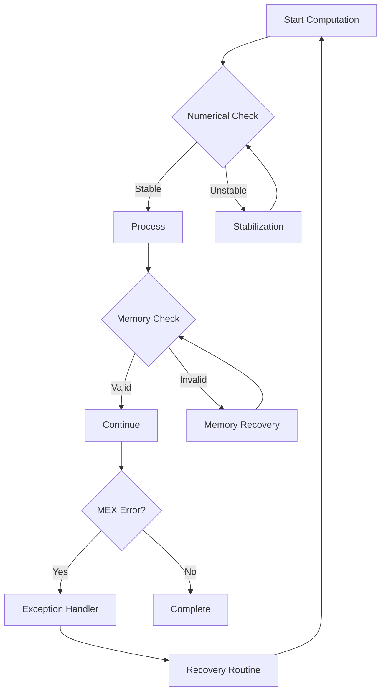
```mermaid
flowchart TD
    A[Start Computation] --> B{Numerical Check}
    B -->|Stable| C[Process]
    B -->|Unstable| D[Stabilization]
    D --> B
    C --> E{Memory Check}
    E -->|Valid| F[Continue]
    E -->|Invalid| G[Memory Recovery]
    G --> E
    F --> H{MEX Error?}
    H -->|Yes| I[Exception Handler]
    H -->|No| J[Complete]
    I --> K[Recovery Routine]
    K --> A
```

## 3.4 Integration Workflows

### 3.4.1 MEX Integration Flow

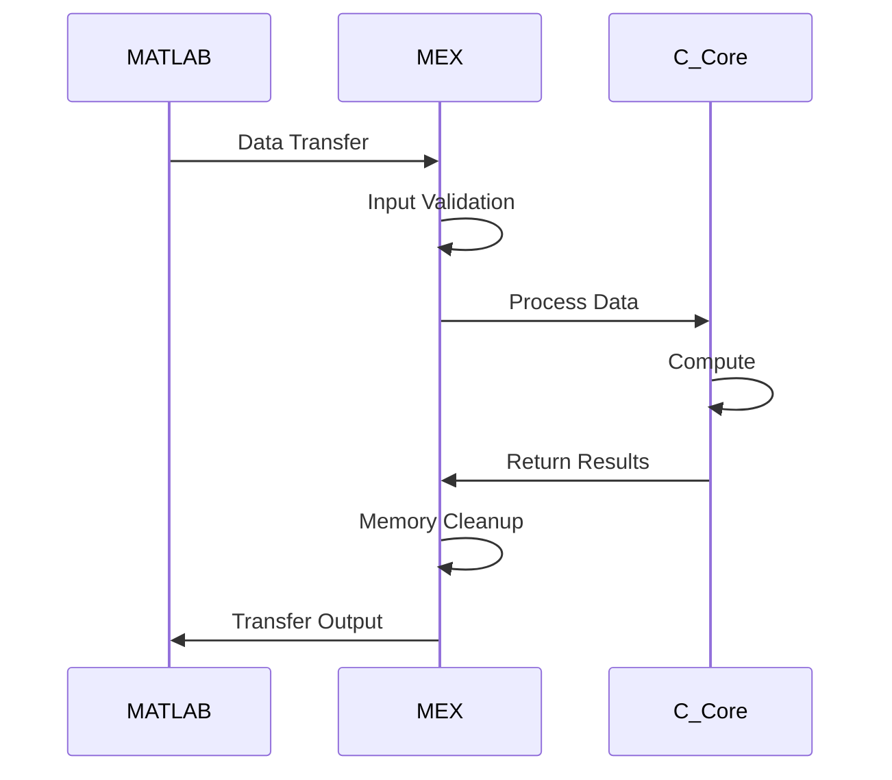
```mermaid
sequenceDiagram
    participant MATLAB
    participant MEX
    participant C_Core

    MATLAB->>MEX: Data Transfer
    MEX->>MEX: Input Validation
    MEX->>C_Core: Process Data
    C_Core->>C_Core: Compute
    C_Core->>MEX: Return Results
    MEX->>MEX: Memory Cleanup
    MEX->>MATLAB: Transfer Output
```

### 3.4.2 GUI Integration Flow

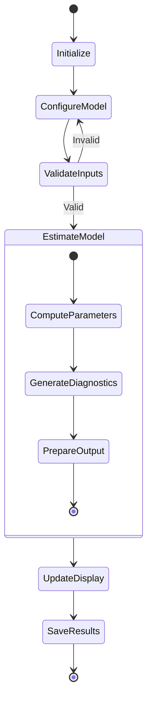
```mermaid
stateDiagram-v2
    [*] --> Initialize
    Initialize --> ConfigureModel
    ConfigureModel --> ValidateInputs
    ValidateInputs --> EstimateModel: Valid
    ValidateInputs --> ConfigureModel: Invalid
    EstimateModel --> UpdateDisplay
    UpdateDisplay --> SaveResults
    SaveResults --> [*]
    
    state EstimateModel {
        [*] --> ComputeParameters
        ComputeParameters --> GenerateDiagnostics
        GenerateDiagnostics --> PrepareOutput
        PrepareOutput --> [*]
    }
```

# 4. SYSTEM ARCHITECTURE

## 4.1 High-Level Architecture Overview

The MFE Toolbox implements a modular monolithic architecture optimized for MATLAB integration and high-performance computing. The system is structured around specialized computational engines and analytical modules that communicate through well-defined interfaces.

### 4.1.1 System Context Diagram (Level 0)

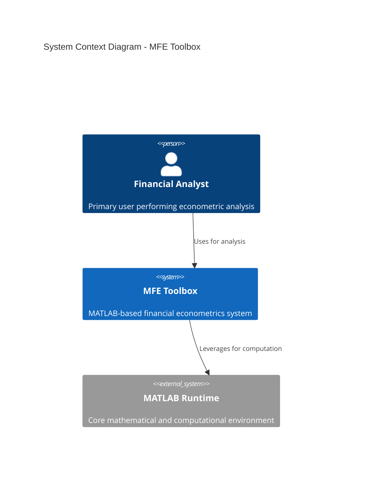
```mermaid
C4Context
    title System Context Diagram - MFE Toolbox

    Person(analyst, "Financial Analyst", "Primary user performing econometric analysis")
    System(mfe, "MFE Toolbox", "MATLAB-based financial econometrics system")
    System_Ext(matlab, "MATLAB Runtime", "Core mathematical and computational environment")
    
    Rel(analyst, mfe, "Uses for analysis")
    Rel(mfe, matlab, "Leverages for computation")
    
    UpdateLayoutConfig($c4ShapeInRow="3", $c4BoundaryInRow="1")
```

### 4.1.2 Container Diagram (Level 1)

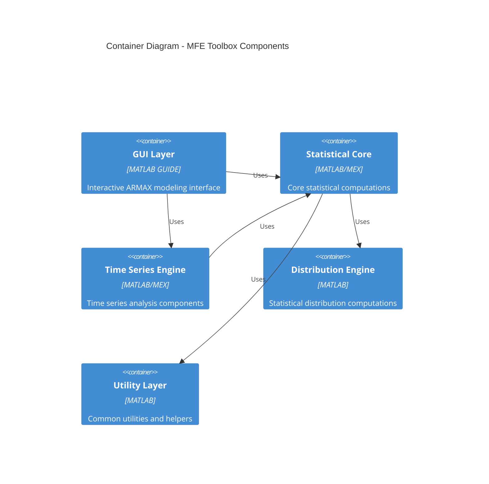
```mermaid
C4Container
    title Container Diagram - MFE Toolbox Components

    Container(gui, "GUI Layer", "MATLAB GUIDE", "Interactive ARMAX modeling interface")
    Container(core, "Statistical Core", "MATLAB/MEX", "Core statistical computations")
    Container(ts, "Time Series Engine", "MATLAB/MEX", "Time series analysis components")
    Container(dist, "Distribution Engine", "MATLAB", "Statistical distribution computations")
    Container(util, "Utility Layer", "MATLAB", "Common utilities and helpers")
    
    Rel(gui, core, "Uses")
    Rel(gui, ts, "Uses")
    Rel(ts, core, "Uses")
    Rel(core, dist, "Uses")
    Rel(core, util, "Uses")
    
    UpdateLayoutConfig($c4ShapeInRow="3", $c4BoundaryInRow="1")
```

## 4.2 Component Details

### 4.2.1 MEX Computational Engine
- **Purpose**: High-performance numerical computations for critical paths
- **Technologies**:
  - C language implementation
  - MEX API integration
  - MATLAB Runtime interface
- **Key Interfaces**:
  - mexFunction entry points
  - Matrix data transfer protocols
  - Memory management routines
- **Performance Characteristics**:
  - Optimized for large array operations
  - Direct memory access patterns
  - Minimal data copying overhead

### 4.2.2 Statistical Analysis Core
- **Purpose**: Implementation of statistical methods and tests
- **Components**:
  - Distribution computation engine
  - Bootstrap framework
  - Cross-sectional analysis tools
  - Statistical testing suite
- **Data Flow**:
  - Matrix-based data structures
  - In-memory computation paths
  - Vectorized operations

### 4.2.3 Time Series Analysis Engine
- **Purpose**: Time series modeling and forecasting
- **Components**:
  - ARMA/ARMAX modeling
  - Univariate/Multivariate volatility
  - High-frequency analysis tools
  - Realized volatility computation
- **Interfaces**:
  - Model parameter estimation
  - Forecast generation
  - Diagnostic computation

### 4.2.4 GUI Framework
- **Purpose**: Interactive model configuration and visualization
- **Components**:
  - ARMAX modeling interface
  - Parameter configuration panels
  - Results visualization
  - Diagnostic plots
- **Technologies**:
  - MATLAB GUIDE framework
  - Event-driven architecture
  - Callback mechanism

## 4.3 Technical Decisions

### 4.3.1 Architecture Style
- **Choice**: Modular Monolithic
- **Rationale**:
  - Optimized for MATLAB integration
  - Simplified deployment process
  - Direct function calls for performance
  - Cohesive codebase management

### 4.3.2 Performance Optimization
- **MEX Integration**:
  - Critical path optimization
  - Native code execution
  - Minimal overhead design
- **Matrix Operations**:
  - Vectorized computations
  - Memory preallocation
  - Efficient array handling

### 4.3.3 Data Management
- **Strategy**:
  - In-memory matrix storage
  - Pass-by-reference optimization
  - Efficient memory recycling
- **Persistence**:
  - Temporary workspace storage
  - Results caching when appropriate
  - Memory-mapped files for large datasets

## 4.4 Cross-Cutting Concerns

### 4.4.1 Error Handling
- **Validation Layer**:
  - Input parameter verification
  - Dimension compatibility checks
  - Numerical stability validation
- **Recovery Mechanisms**:
  - Graceful degradation
  - Memory cleanup routines
  - Error propagation protocols

### 4.4.2 Performance Monitoring
- **Metrics**:
  - Computation time tracking
  - Memory usage monitoring
  - Resource utilization
- **Optimization**:
  - Algorithmic efficiency
  - Memory footprint management
  - Cache utilization

### 4.4.3 Security
- **Data Validation**:
  - Boundary checking
  - Type verification
  - Memory protection
- **Resource Protection**:
  - Workspace isolation
  - Memory bounds checking
  - Access control mechanisms

## 4.5 Deployment Architecture

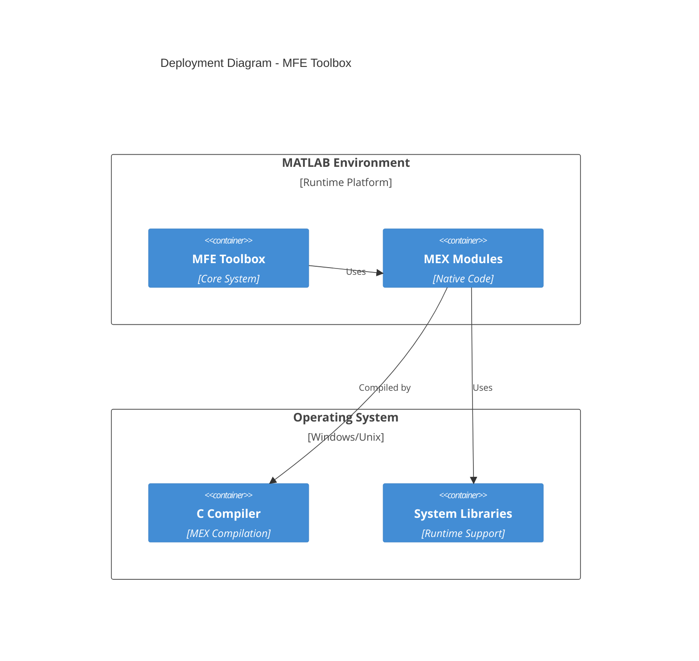
```mermaid
C4Deployment
    title Deployment Diagram - MFE Toolbox

    Deployment_Node(matlab, "MATLAB Environment", "Runtime Platform") {
        Container(mfe, "MFE Toolbox", "Core System")
        Container(mex, "MEX Modules", "Native Code")
    }
    
    Deployment_Node(os, "Operating System", "Windows/Unix") {
        Container(compiler, "C Compiler", "MEX Compilation")
        Container(libs, "System Libraries", "Runtime Support")
    }
    
    Rel(mfe, mex, "Uses")
    Rel(mex, compiler, "Compiled by")
    Rel(mex, libs, "Uses")
    
    UpdateLayoutConfig($c4ShapeInRow="2", $c4BoundaryInRow="1")
```

# 5. SYSTEM COMPONENTS DESIGN

## 5.1 Core Services Architecture

### 5.1.1 Service Components

The MFE Toolbox implements a layered service architecture with specialized computational engines and analytical modules.

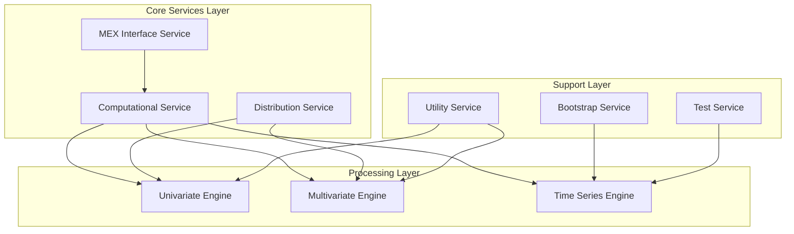
```mermaid
graph TB
    subgraph "Core Services Layer"
        MEX[MEX Interface Service]
        COMP[Computational Service]
        DIST[Distribution Service]
    end
    
    subgraph "Processing Layer"
        UNI[Univariate Engine]
        MULTI[Multivariate Engine]
        TIME[Time Series Engine]
    end
    
    subgraph "Support Layer"
        BOOT[Bootstrap Service]
        UTIL[Utility Service]
        TEST[Test Service]
    end
    
    MEX --> COMP
    COMP --> UNI
    COMP --> MULTI
    COMP --> TIME
    DIST --> UNI
    DIST --> MULTI
    BOOT --> TIME
    UTIL --> UNI
    UTIL --> MULTI
    TEST --> TIME
```

#### Service Boundaries
- **MEX Interface Service**: 
  - Implements high-performance C-based computational services
  - Handles critical numerical computations through optimized C implementations
  - Core files: agarch_core.c, armaxerrors.c, composite_likelihood.c, egarch_core.c, igarch_core.c, tarch_core.c

- **Computational Service**:
  - Manages matrix operations and numerical computations
  - Provides vectorized computation capabilities
  - Implements memory-efficient data structures

- **Distribution Service**:
  - Handles statistical distribution computations
  - Manages parameter estimation and random number generation
  - Provides likelihood evaluation functions

#### Inter-service Communication
- Direct function calls for optimal performance
- Matrix-based data structures for efficient data transfer
- Memory-mapped interfaces for large datasets

#### Service Discovery
- Static function registration through addToPath.m
- Platform-specific MEX binary discovery
- Automatic toolbox path configuration

### 5.1.2 Scalability Design

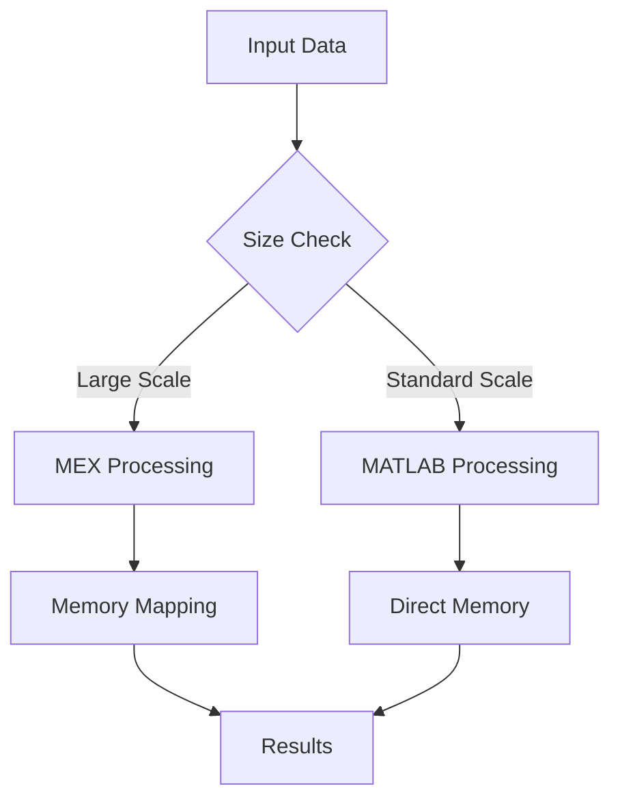
```mermaid
flowchart TD
    A[Input Data] --> B{Size Check}
    B -->|Large Scale| C[MEX Processing]
    B -->|Standard Scale| D[MATLAB Processing]
    C --> E[Memory Mapping]
    D --> F[Direct Memory]
    E --> G[Results]
    F --> G
```

#### Horizontal/Vertical Scaling
- MEX optimization for computationally intensive operations
- Platform-specific compilation with -largeArrayDims flag
- Memory-efficient matrix operations for large datasets

#### Resource Allocation
- Dynamic memory allocation in MEX implementations
- Workspace isolation for parallel processing
- Efficient matrix preallocation strategies

### 5.1.3 Resilience Patterns

#### Fault Tolerance
- Robust input validation across all services
- Memory boundary checking in MEX implementations
- Graceful degradation mechanisms

#### Disaster Recovery
- Automatic memory cleanup routines
- Error state recovery procedures
- Resource deallocation protocols

## 5.2 Database Design

### 5.2.1 Data Management

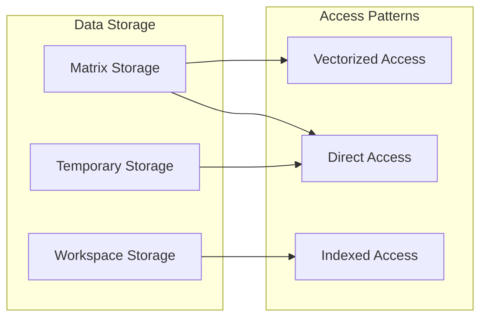
```mermaid
graph LR
    subgraph "Data Storage"
        M[Matrix Storage]
        W[Workspace Storage]
        T[Temporary Storage]
    end
    
    subgraph "Access Patterns"
        V[Vectorized Access]
        D[Direct Access]
        I[Indexed Access]
    end
    
    M --> V
    M --> D
    W --> I
    T --> D
```

#### Data Models
- In-memory matrix storage for efficient computation
- Workspace-based temporary data storage
- Memory-mapped files for large datasets

#### Performance Optimization
- Results caching for frequent computations
- Memory-mapped file access for large datasets
- Vectorized computation patterns

## 5.3 Integration Architecture

### 5.3.1 API Design

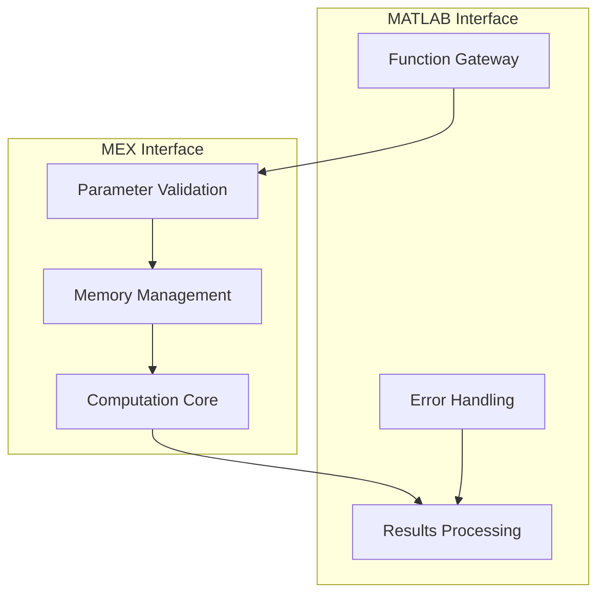
```mermaid
graph TB
    subgraph "MEX Interface"
        M1[Parameter Validation]
        M2[Memory Management]
        M3[Computation Core]
    end
    
    subgraph "MATLAB Interface"
        F1[Function Gateway]
        F2[Error Handling]
        F3[Results Processing]
    end
    
    M1 --> M2
    M2 --> M3
    F1 --> M1
    M3 --> F3
    F2 --> F3
```

#### Protocol Specifications
- MEX API integration for C-based computations
- Matrix-based data transfer protocols
- Standardized error handling interfaces

#### Authentication/Authorization
- Input validation and verification
- Memory boundary protection
- Resource access control

### 5.3.2 Message Processing

#### Event Processing
- Matrix operation events
- Computation completion signals
- Error state notifications

#### Error Handling
- Comprehensive input validation
- Memory protection mechanisms
- Error propagation protocols

## 5.4 Security Architecture

### 5.4.1 Input Protection

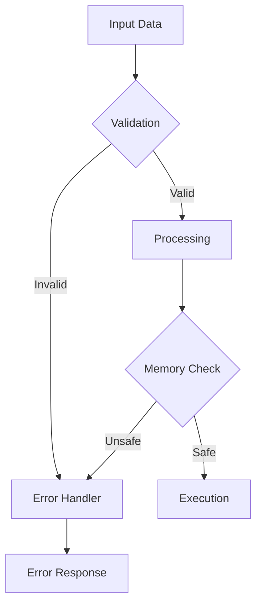
```mermaid
flowchart TD
    A[Input Data] --> B{Validation}
    B -->|Valid| C[Processing]
    B -->|Invalid| D[Error Handler]
    C --> E{Memory Check}
    E -->|Safe| F[Execution]
    E -->|Unsafe| D
    D --> G[Error Response]
```

#### Validation Framework
- Parameter checking and validation
- Dimension compatibility verification
- Numerical stability assessment

#### Resource Protection
- Memory bounds checking
- Workspace isolation
- Access control mechanisms

### 5.4.2 Data Protection

#### Memory Management
- Strict boundary checking
- Resource cleanup routines
- Allocation protection

#### Security Controls
- Input sanitization
- Resource isolation
- Error containment

# 6. TECHNOLOGY STACK

## 6.1 PROGRAMMING LANGUAGES

### Primary Languages
1. MATLAB
   - Version: 4.0 (Released: 28-Oct-2009)
   - Usage: Core implementation language
   - Components:
     * Statistical and econometric functions
     * GUI development (GUIDE framework)
     * High-level algorithms
     * Matrix operations
   - Justification:
     * Native MATLAB integration
     * Built-in matrix operations
     * Scientific computing capabilities
     * Extensive toolbox ecosystem

2. C Language
   - Usage: Performance-critical computations
   - Components:
     * MEX interface implementations
     * Core numerical algorithms
     * Optimized matrix operations
   - Justification:
     * High-performance requirements
     * Direct memory management
     * MEX integration capability
     * Platform-specific optimization

## 6.2 FRAMEWORKS & LIBRARIES

### Core MATLAB Dependencies
1. MATLAB Base Framework
   - MATLAB Statistics Toolbox
   - MATLAB Optimization Toolbox
   - MATLAB GUIDE (GUI Development Environment)

2. MEX Development Framework
   - Components:
     * MATLAB MEX API (mex.h, matrix.h)
     * Platform-specific MEX binaries
       - Windows: *.mexw64
       - Unix: *.mexa64
   - Purpose:
     * High-performance computation
     * Native code integration
     * Memory optimization

3. Standard C Libraries
   - math.h: Mathematical functions
   - limits.h: Numerical limits
   - Purpose: Core C implementations

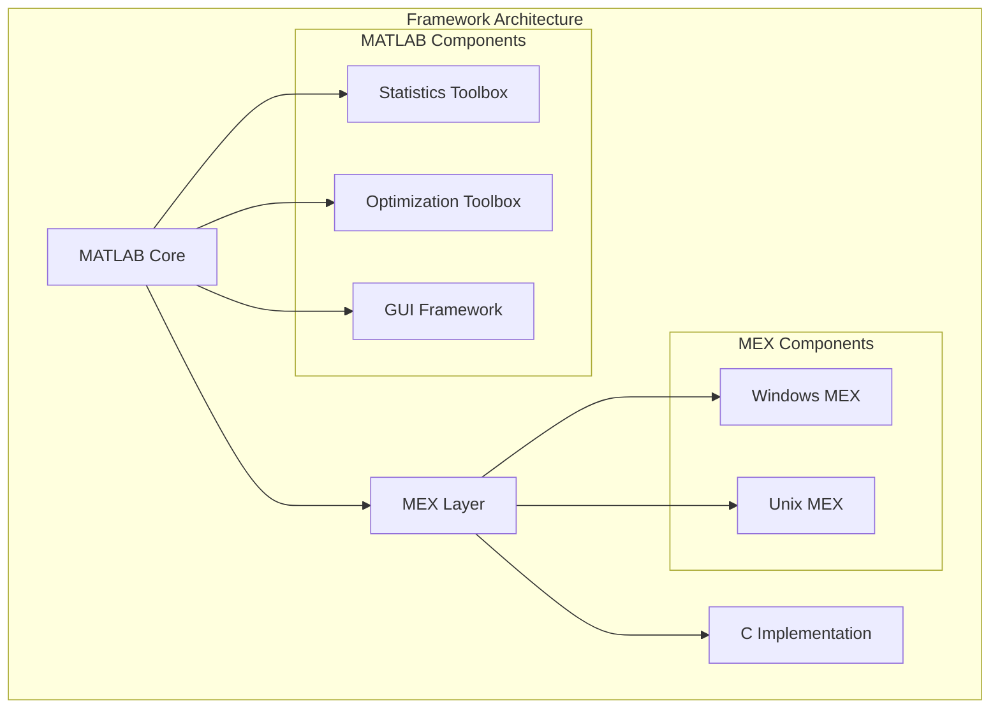
```mermaid
graph TB
    subgraph "Framework Architecture"
        MATLAB[MATLAB Core]
        MEX[MEX Layer]
        C[C Implementation]
        
        MATLAB --> MEX
        MEX --> C
        
        subgraph "MATLAB Components"
            STATS[Statistics Toolbox]
            OPT[Optimization Toolbox]
            GUIDE[GUI Framework]
        end
        
        subgraph "MEX Components"
            WIN[Windows MEX]
            UNIX[Unix MEX]
        end
        
        MATLAB --> STATS
        MATLAB --> OPT
        MATLAB --> GUIDE
        MEX --> WIN
        MEX --> UNIX
    end
```

## 6.3 DEVELOPMENT & DEPLOYMENT

### Build System
1. MATLAB Build Infrastructure
   - Custom build script (buildZipFile.m)
   - MEX compilation with -largeArrayDims flag
   - Platform-specific binary generation

2. Development Tools
   - MATLAB IDE
   - C Compiler (Platform-specific)
   - MATLAB GUIDE for GUI development

3. Deployment Configuration
   - Automated path configuration (addToPath.m)
   - Platform-specific MEX binary deployment
   - ZIP archive packaging

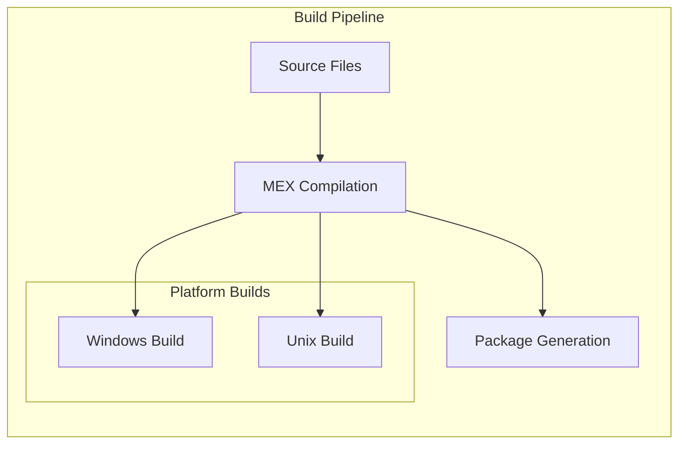
```mermaid
graph LR
    subgraph "Build Pipeline"
        SRC[Source Files]
        MEX[MEX Compilation]
        PKG[Package Generation]
        
        SRC --> MEX
        MEX --> PKG
        
        subgraph "Platform Builds"
            WIN[Windows Build]
            UNIX[Unix Build]
        end
        
        MEX --> WIN
        MEX --> UNIX
    end
```

## 6.4 SYSTEM REQUIREMENTS

### Platform Support
1. Operating Systems
   - Windows (PCWIN64)
   - Unix systems

2. Runtime Dependencies
   - MATLAB Runtime Environment
   - Platform-specific C runtime
   - MEX binary compatibility

### Performance Optimization
1. MEX Optimization
   - C-based core computations
   - Memory-efficient algorithms
   - Platform-specific optimizations

2. MATLAB Optimization
   - Vectorized operations
   - Matrix computation optimization
   - Memory preallocation strategies

```mermaid
graph TB
    subgraph "System Architecture"
        MATLAB[MATLAB Environment]
        MEX[MEX Layer]
        OS[Operating System]
        
        MATLAB --> MEX
        MEX --> OS
        
        subgraph "Runtime Components"
            MRE[MATLAB Runtime]
            CRT[C Runtime]
            BIN[MEX Binaries]
        end
        
        OS --> MRE
        OS --> CRT
        MEX --> BIN
    end
```

## 6.5 INTEGRATION ARCHITECTURE

### Component Integration
1. Core Integration
   - MATLAB function interfaces
   - MEX gateway functions
   - C-level optimizations

2. Data Flow
   - Matrix-based data structures
   - Memory-mapped interfaces
   - Optimized data transfer

3. Error Handling
   - Cross-language error propagation
   - Memory protection
   - Resource cleanup

```mermaid
graph TB
    subgraph "Integration Flow"
        MATLAB[MATLAB Layer]
        MEX[MEX Interface]
        C[C Implementation]
        
        MATLAB --> |Data| MEX
        MEX --> |Processing| C
        C --> |Results| MEX
        MEX --> |Output| MATLAB
        
        subgraph "Error Handling"
            VAL[Validation]
            PROP[Propagation]
            CLEAN[Cleanup]
        end
        
        MEX --> VAL
        VAL --> PROP
        PROP --> CLEAN
    end
```

# 7. USER INTERFACE DESIGN

## 7.1 Overview

The MFE Toolbox implements a specialized graphical user interface (GUI) focused on ARMAX (AutoRegressive Moving Average with eXogenous inputs) modeling. The GUI is built using MATLAB's GUIDE (GUI Development Environment) framework and follows a singleton pattern for window management.

### 7.1.1 Architecture

```mermaid
graph TB
    subgraph "GUI Components"
        MAIN[ARMAX Main Window]
        VIEW[Results Viewer]
        ABOUT[About Dialog]
        CLOSE[Close Dialog]
    end
    
    subgraph "Core Functions"
        MODEL[Model Estimation]
        PLOT[Plotting Engine]
        DIAG[Diagnostics]
    end
    
    MAIN --> MODEL
    MAIN --> PLOT
    MODEL --> VIEW
    DIAG --> VIEW
```

## 7.2 Interface Components

### 7.2.1 Main Application Window (ARMAX.m)
```
+------------------------------------------+
| ARMAX Model Estimation                [x] |
+------------------------------------------+
| [#] Model Configuration                   |
|  +----------------------------------+    |
|  | AR Order: [...] MA Order: [...]  |    |
|  | [Button: Estimate]               |    |
|  +----------------------------------+    |
|                                          |
| [=] Data Visualization                   |
|  +----------------------------------+    |
|  |        Time Series Plot          |    |
|  |     [Interactive Graph Area]     |    |
|  +----------------------------------+    |
|                                          |
| [@] Diagnostics                          |
|  +----------------------------------+    |
|  | [ ] ACF  [ ] PACF  [ ] Residuals|    |
|  |     [Statistical Results]        |    |
|  +----------------------------------+    |
|                                          |
| [Button: View Results] [Button: Close]   |
+------------------------------------------+

Key:
[#] - Menu/Dashboard
[=] - Settings
[@] - User/Profile
[x] - Close
```

### 7.2.2 Results Viewer (ARMAX_viewer.m)
```
+------------------------------------------+
| ARMAX Results Viewer                  [x] |
+------------------------------------------+
| Model Summary:                           |
| +------------------------------------+   |
| | LaTeX Rendered Model Equation      |   |
| +------------------------------------+   |
|                                          |
| Parameter Estimates:                     |
| +------------------------------------+   |
| | [v] Parameter Selection Dropdown   |   |
| | [====] Estimation Progress        |   |
| | Parameter  Estimate   Std.Error   |   |
| | ...        ...       ...         |   |
| +------------------------------------+   |
|                                          |
| [<] Previous  Page 1/N  Next [>]        |
+------------------------------------------+

Key:
[v] - Dropdown
[====] - Progress Bar
[<][>] - Navigation
```

### 7.2.3 Support Dialogs

#### About Dialog (ARMAX_about.m)
```
+----------------------------------+
| About ARMAX                   [x] |
+----------------------------------+
|     [i] MFE Toolbox v4.0        |
|                                  |
|     [OxLogo Image]              |
|                                  |
|     © 2009 All Rights Reserved  |
|                                  |
|        [Button: OK]             |
+----------------------------------+

Key:
[i] - Information
```

#### Close Confirmation (ARMAX_close_dialog.m)
```
+----------------------------------+
| Confirm Close                 [x] |
+----------------------------------+
|     [!] Save changes before      |
|         closing?                 |
|                                  |
|    [Button: Yes] [Button: No]    |
+----------------------------------+

Key:
[!] - Warning
```

## 7.3 Interaction Design

### 7.3.1 Navigation Flow
```mermaid
stateDiagram-v2
    [*] --> MainWindow
    MainWindow --> ResultsViewer: View Results
    MainWindow --> AboutDialog: Help
    MainWindow --> CloseDialog: Close
    ResultsViewer --> MainWindow: Back
    AboutDialog --> MainWindow: OK
    CloseDialog --> MainWindow: Cancel
    CloseDialog --> [*]: Confirm
```

### 7.3.2 Event Handling
- Mouse Events:
  * Click callbacks for buttons and controls
  * Interactive plot zooming and panning
  * Dropdown selection handling

- Keyboard Events:
  * Escape key for dialog cancellation
  * Return key for dialog confirmation
  * Numeric input validation

### 7.3.3 State Management
- Window Lifecycle:
  * Singleton pattern for main windows
  * Modal dialogs for user interaction
  * Persistent data storage via guidata

- Data Flow:
  * Parameter validation and transformation
  * Real-time plot updates
  * Dynamic results pagination

## 7.4 Technical Implementation

### 7.4.1 Framework Integration
- MATLAB GUIDE Components:
  * Figure layouts (.fig files)
  * Callback mechanisms
  * Property management

- Dependencies:
  * Core model: armaxfilter.m
  * Statistics: sacf.m, spacf.m
  * Diagnostics: lmtest1.m, ljungbox.m
  * Model selection: aicsbic.m

### 7.4.2 Performance Considerations
- Plot Optimization:
  * Efficient data rendering
  * Selective plot updates
  * Memory-conscious display management

- Response Time:
  * Asynchronous computation handling
  * Progressive result display
  * Optimized callback execution

# 8. INFRASTRUCTURE

## 8.1 DEPLOYMENT ENVIRONMENT

The MFE Toolbox is designed for on-premises deployment within MATLAB environments, with cross-platform support for both Windows (PCWIN64) and Unix systems. The deployment architecture emphasizes local installation and execution, without cloud dependencies.

### 8.1.1 Platform Requirements

```mermaid
graph TB
    subgraph "Deployment Environment"
        MATLAB[MATLAB Runtime]
        COMP[C Compiler]
        OS[Operating System]
        
        subgraph "Platform Support"
            WIN[Windows PCWIN64]
            UNIX[Unix Systems]
        end
        
        OS --> WIN
        OS --> UNIX
        WIN --> MATLAB
        UNIX --> MATLAB
        MATLAB --> COMP
    end
```

1. Operating System Support
   - Windows (PCWIN64)
     * MEX binary format: *.mexw64
     * DLL dependencies in 'dlls' directory
   - Unix Systems
     * MEX binary format: *.mexa64
     * Platform-specific runtime libraries

2. Runtime Dependencies
   - Core MATLAB installation
   - MATLAB Statistics Toolbox
   - MATLAB Optimization Toolbox
   - Platform-specific C compiler for MEX compilation
   - C Runtime libraries

## 8.2 CLOUD SERVICES

The MFE Toolbox is designed as a standalone, on-premises solution without cloud service dependencies. This architectural choice ensures:

1. Data Privacy
   - All computations performed locally
   - No external service dependencies
   - Complete data control within user environment

2. Performance
   - Direct access to local computing resources
   - Minimized latency for numerical operations
   - Optimized memory utilization

## 8.3 CONTAINERIZATION

The system utilizes native MATLAB deployment rather than containerization. Distribution is managed through a ZIP archive (MFEToolbox.zip) containing all required components:

### 8.3.1 Package Structure

```mermaid
graph TB
    subgraph "MFEToolbox.zip"
        BOOT[bootstrap/]
        CROSS[crosssection/]
        DIST[distributions/]
        GUI[GUI/]
        MULTI[multivariate/]
        TEST[tests/]
        TIME[timeseries/]
        UNI[univariate/]
        UTIL[utility/]
        REAL[realized/]
        MEX[mex_source/]
        DLL[dlls/]
        DUP[duplication/]
        ADD[addToPath.m]
        CONT[Contents.m]
    end
```

1. Mandatory Directories
   - bootstrap/: Bootstrap implementation
   - crosssection/: Cross-sectional analysis tools
   - distributions/: Statistical distribution functions
   - GUI/: ARMAX modeling interface
   - multivariate/: Multivariate analysis tools
   - tests/: Statistical testing suite
   - timeseries/: Time series analysis
   - univariate/: Univariate analysis tools
   - utility/: Helper functions
   - realized/: High-frequency analysis
   - mex_source/: C source files
   - dlls/: Platform-specific MEX binaries

2. Optional Components
   - duplication/: Custom implementations

## 8.4 ORCHESTRATION

The system employs a script-based orchestration approach for deployment and configuration:

### 8.4.1 Build Process

```mermaid
flowchart TD
    A[buildZipFile.m] --> B[Clear Workspace]
    B --> C[Compile C Sources]
    C --> D[Generate MEX]
    D --> E[Package Files]
    E --> F[Create ZIP]
    
    subgraph "MEX Compilation"
        C
        D
    end
    
    subgraph "Distribution"
        E
        F
    end
```

1. Build Automation (buildZipFile.m)
   - Workspace cleanup
   - C source compilation with '-largeArrayDims'
   - Platform-specific MEX generation
   - Component packaging
   - ZIP archive creation

2. Installation Process (addToPath.m)
   - MATLAB path configuration
   - Platform-specific binary inclusion
   - Optional component handling
   - Permanent path configuration option

## 8.5 CI/CD PIPELINE

The build and deployment pipeline is implemented through MATLAB scripts:

### 8.5.1 Pipeline Components

```mermaid
flowchart LR
    A[Source Code] --> B[Build Process]
    B --> C[MEX Compilation]
    C --> D[Package Generation]
    D --> E[Distribution]
    
    subgraph "Build Steps"
        B
        C
        D
    end
```

1. Build Process
   - Source preparation
   - MEX compilation
   - Binary generation
   - Package assembly

2. Installation
   - Path configuration
   - Component validation
   - Environment setup
   - Optional module handling

3. Validation
   - Binary compatibility checks
   - Path verification
   - Component accessibility testing
   - Optional module validation

# APPENDICES

## A. Technical Information

### A.1 Build System Details
- **Compilation Configuration**
  * MEX Compilation Flag: '-largeArrayDims'
  * Platform-Specific Binary Formats:
    - Windows: *.mexw64
    - Unix: *.mexa64
  * Distribution Format: MFEToolbox.zip

### A.2 Core MEX Files
- **Performance-Critical C Implementations**
  * agarch_core.c: AGARCH model computations
  * armaxerrors.c: ARMAX residual error computation
  * composite_likelihood.c: Composite likelihood computation
  * egarch_core.c: EGARCH algorithm implementation
  * igarch_core.c: IGARCH model computations
  * tarch_core.c: TARCH/GARCH variance computations

### A.3 Mandatory Directory Structure
```mermaid
graph TB
    ROOT[MFE Toolbox Root]
    ROOT --> BOOT[bootstrap/]
    ROOT --> CROSS[crosssection/]
    ROOT --> DIST[distributions/]
    ROOT --> GUI[GUI/]
    ROOT --> MULTI[multivariate/]
    ROOT --> TEST[tests/]
    ROOT --> TIME[timeseries/]
    ROOT --> UNI[univariate/]
    ROOT --> UTIL[utility/]
    ROOT --> REAL[realized/]
    ROOT --> MEX[mex_source/]
    ROOT --> DLL[dlls/]
```

## B. Glossary

### B.1 Technical Terms
| Term | Definition |
|------|------------|
| Back-casting | Technique for initializing variance estimates in GARCH models |
| Composite Likelihood | Statistical method combining multiple likelihood components |
| Conditional Variance | Time-varying variance in volatility models |
| MEX | MATLAB Executable format for C/C++ integration |
| Vector Operation | Matrix-based computation optimized for performance |
| Work-alike Functions | Custom implementations of standard MATLAB functions |

### B.2 Model-specific Terms
| Term | Definition |
|------|------------|
| AGARCH | Asymmetric GARCH model |
| EGARCH | Exponential GARCH model |
| IGARCH | Integrated GARCH model |
| TARCH | Threshold ARCH model |
| NAGARCH | Nonlinear Asymmetric GARCH model |

## C. Acronyms

### C.1 Statistical and Econometric
| Acronym | Definition |
|---------|------------|
| ACF | AutoCorrelation Function |
| AR | AutoRegressive |
| ARMA | AutoRegressive Moving Average |
| ARMAX | AutoRegressive Moving Average with eXogenous inputs |
| GARCH | Generalized AutoRegressive Conditional Heteroskedasticity |
| GED | Generalized Error Distribution |
| MA | Moving Average |
| PACF | Partial AutoCorrelation Function |
| SARIMA | Seasonal ARIMA |

### C.2 Technical and System
| Acronym | Definition |
|---------|------------|
| API | Application Programming Interface |
| DLL | Dynamic Link Library |
| GUI | Graphical User Interface |
| MEX | MATLAB EXecutable |
| PCWIN64 | Windows 64-bit Platform Code |

### C.3 File References
| Reference | Description |
|-----------|-------------|
| Contents.m | Version 4.0 (28-Oct-2009) |
| addToPath.m | Path configuration utility |
| buildZipFile.m | Build automation script |