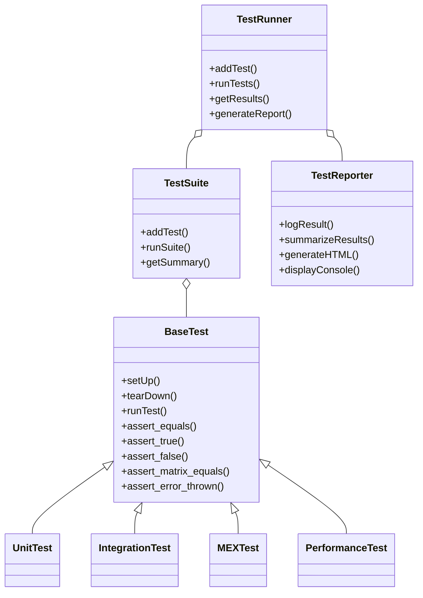

# MFE Toolbox Testing Framework

## Introduction

The MFE Toolbox testing framework provides a comprehensive infrastructure for ensuring the reliability, performance, and cross-platform compatibility of the MATLAB Financial Econometrics Toolbox. This testing framework is designed to validate all aspects of the toolbox's functionality across its three primary component groups:

1. **Core Statistical Components** - Distribution analysis, bootstrap methods, testing suites, and cross-sectional tools
2. **Time Series Components** - ARMA/ARMAX models, univariate/multivariate volatility models, and high-frequency analysis
3. **Support Infrastructure** - Utility functions, MEX optimizations, and platform compatibility

The testing framework is a critical component in maintaining the toolbox's reliability standards, providing comprehensive validation of error handling, numerical stability, and performance characteristics across all supported platforms.

## Test Framework Architecture

The MFE Toolbox testing framework is built on a robust object-oriented architecture with the following key components:



### Key Components

1. **BaseTest Class** - Abstract base class providing fundamental test infrastructure including setup, teardown, and assertion methods.

2. **TestRunner** - Manages test execution, collects results, and coordinates with the TestReporter for result output.

3. **TestSuite** - Organizes collections of related tests and provides aggregate results.

4. **TestReporter** - Outputs test results in various formats including console output and HTML reports.

## Test Categories

The testing framework is organized into eight distinct categories, each focused on validating specific aspects of the MFE Toolbox:

### 1. Unit Tests
- **Purpose**: Validate individual functions and methods in isolation
- **Location**: `src/test/unit/`
- **Naming Convention**: `*_unit_test.m`
- **Focus Areas**:
  - Function parameter validation
  - Computational accuracy
  - Error handling
  - Edge case handling

### 2. Integration Tests
- **Purpose**: Verify interactions between multiple components
- **Location**: `src/test/integration/`
- **Naming Convention**: `*_integration_test.m`
- **Focus Areas**:
  - Cross-component workflows (e.g., ARMA + volatility modeling)
  - Data handoff between components
  - Complex computational pipelines

### 3. MEX Tests
- **Purpose**: Validate C-based MEX implementations
- **Location**: `src/test/mex/`
- **Naming Convention**: `*_mex_test.m`
- **Focus Areas**:
  - MEX compilation validation
  - Numerical equivalence with MATLAB implementations
  - Memory management
  - Platform-specific behavior

### 4. Performance Tests
- **Purpose**: Benchmark computational performance
- **Location**: `src/test/performance/`
- **Naming Convention**: `*_performance_test.m`
- **Focus Areas**:
  - Execution time measurement
  - Memory usage profiling
  - Scaling with data size
  - MEX optimization verification

### 5. Cross-Platform Tests
- **Purpose**: Ensure consistent behavior across platforms
- **Location**: `src/test/platform/`
- **Naming Convention**: `*_platform_test.m`
- **Focus Areas**:
  - Windows vs. Unix compatibility
  - Platform-specific MEX behavior
  - Path management differences
  - Numerical precision variations

### 6. Validation Tests
- **Purpose**: Verify statistical validity against known benchmarks
- **Location**: `src/test/validation/`
- **Naming Convention**: `*_validation_test.m`
- **Focus Areas**:
  - Comparison against published results
  - Statistical property validation
  - Numerical stability under various conditions

### 7. System Tests
- **Purpose**: Test complete end-to-end workflows
- **Location**: `src/test/system/`
- **Naming Convention**: `*_system_test.m`
- **Focus Areas**:
  - Complete analysis pipelines
  - GUI functionality
  - Initialization and setup processes
  - Error recovery mechanisms

### 8. Documentation Tests
- **Purpose**: Validate documentation examples
- **Location**: `src/test/docs/`
- **Naming Convention**: `*_doc_test.m`
- **Focus Areas**:
  - Example code validity
  - Function signature accuracy
  - Help text correctness
  - Function behavior as documented

## Running Tests

### Quick Start

To run all tests:

```matlab
% Navigate to the MFE Toolbox root directory
cd /path/to/MFEToolbox
% Run all tests
run_all_tests
```

To run a specific test category:

```matlab
% Run only unit tests
run_unit_tests

% Run only MEX tests
run_mex_tests

% Run integration tests with verbose output
run_integration_tests('-v')
```

### Command-Line Options

All test runner scripts support the following options:

| Option | Description |
|--------|-------------|
| `-v, --verbose` | Enable detailed output for each test |
| `-q, --quiet` | Minimal output (summary only) |
| `-h, --html` | Generate HTML report in `test_reports/` |
| `-x, --xml` | Generate JUnit-compatible XML report |
| `-f, --filter PATTERN` | Run only tests matching the pattern |
| `-p, --platform` | Run platform-specific tests only |

### Configuration Parameters

Test behavior can be configured via the `test_config.m` file:

```matlab
% Sample test_config.m
testConfig.MEXCompiler = 'gcc';          % Specify MEX compiler
testConfig.skipSlowTests = true;         % Skip long-running tests
testConfig.reportDir = 'my_test_reports'; % Custom report directory
testConfig.dataSets = {'small', 'medium'}; % Data size options
```

### Test Results Interpretation

Test results are presented in a structured format:

```
=== MFE Toolbox Test Results ===
Unit Tests: 120/120 passed (100.0%)
Integration Tests: 45/48 passed (93.8%)
MEX Tests: 36/36 passed (100.0%)
Performance Tests: 18/20 passed (90.0%)
...
Failed Tests:
- integration_garch_forecast_test > test_forecast_multiple_horizon
  Expected: [1.2, 1.4, 1.5], Got: [1.2, 1.4, 1.52]
- performance_large_dataset_test > test_memory_usage
  Memory exceeded threshold: 1.2GB > 1.0GB

Overall: 234/240 tests passed (97.5%)
```

## Creating New Tests

### Basic Test Template

To create a new test case, extend the BaseTest class:

```matlab
classdef my_new_unit_test < BaseTest
    methods
        function setUp(obj)
            % Setup code runs before each test
            obj.testData = load('financial_returns.mat');
        end
        
        function tearDown(obj)
            % Cleanup code runs after each test
            clear obj.testData;
        end
        
        function test_my_feature(obj)
            % Test case implementation
            result = my_function(obj.testData.returns);
            obj.assert_equals(size(result), [100, 1]);
            obj.assert_true(all(result > 0));
        end
        
        function test_error_handling(obj)
            % Test error conditions
            obj.assert_error_thrown(@() my_function([]), 'MATLAB:InputRequired');
        end
    end
end
```

### Best Practices for Test Creation

1. **Naming Conventions**:
   - Use descriptive test method names: `test_forecast_accuracy_weekly`
   - Name test files according to category: `garch_unit_test.m`

2. **Test Organization**:
   - Group related tests in the same class
   - Create separate test methods for different aspects of functionality
   - Keep test methods focused and concise (test one concept per method)

3. **Assertion Usage**:
   - Use the most specific assertion method available
   - Include descriptive failure messages
   - Test both positive and negative cases

4. **Data Management**:
   - Use standard test datasets where possible
   - Clean up in tearDown to avoid state persistence between tests
   - Document data dependencies

## Test Data

The framework provides standardized test datasets in `src/test/data/`:

| Dataset | Description | Usage |
|---------|-------------|-------|
| `financial_returns.mat` | Daily returns for multiple assets | Time series modeling, volatility |
| `high_frequency_data.mat` | Tick data for equity trading | High-frequency analysis |
| `simulated_series.mat` | Simulated time series with known properties | Statistical validation |
| `cross_section_data.mat` | Cross-sectional financial data | Cross-sectional analysis |
| `bootstrap_test_data.mat` | Time series for bootstrap validation | Bootstrap methods |

To use standard test data:

```matlab
function test_garch_estimation(obj)
    % Load standard test data
    data = load(fullfile(getTestDataPath(), 'financial_returns.mat'));
    
    % Run test with standardized data
    params = estimate_garch(data.returns);
    
    % Validate against expected values
    obj.assert_matrix_equals(params, obj.expectedParams, 1e-4);
end
```

## MEX Testing

The MEX testing framework includes specialized capabilities for testing C-based implementations:

### Compilation Validation

```matlab
function test_mex_compilation(obj)
    % Test MEX file compilation
    mexFile = 'agarch_core';
    sourceFile = fullfile('mex_source', [mexFile '.c']);
    
    % Clean existing MEX files
    delete([mexFile '.*']);
    
    % Test compilation
    try
        mex('-largeArrayDims', sourceFile);
        obj.assert_true(exist([mexFile '.' mexext], 'file') == 3);
    catch ME
        obj.fail(['MEX compilation failed: ' ME.message]);
    end
end
```

### Numerical Equivalence Testing

```matlab
function test_mex_numerical_equivalence(obj)
    % Compare MATLAB vs. MEX implementation
    data = obj.testData.returns;
    
    % MATLAB implementation
    [matlab_result, matlab_time] = obj.timeExecution(@() ...
        tarch_matlab(data, 1, 1, 1));
    
    % MEX implementation
    [mex_result, mex_time] = obj.timeExecution(@() ...
        tarch(data, 1, 1, 1));
    
    % Validate numerical equivalence
    obj.assert_matrix_equals(matlab_result, mex_result, 1e-10);
    
    % Validate performance improvement
    obj.assert_true(mex_time < matlab_time * 0.5, ...
        'MEX implementation not achieving 50% speedup');
end
```

### Cross-Platform MEX Testing

```matlab
function test_cross_platform_mex(obj)
    % Test platform-specific MEX behavior
    if ispc()
        mexFile = 'tarch_core.mexw64';
    else
        mexFile = 'tarch_core.mexa64';
    end
    
    obj.assert_true(exist(fullfile('dlls', mexFile), 'file') > 0, ...
        ['Platform-specific MEX file not found: ' mexFile]);
    
    % Further platform-specific tests...
end
```

## Performance Benchmarking

The performance testing framework allows systematic measurement of computational efficiency:

### Benchmark Measurement

```matlab
function test_performance_benchmark(obj)
    % Define test sizes
    sizes = [100, 1000, 10000];
    results = zeros(length(sizes), 2);
    
    for i = 1:length(sizes)
        n = sizes(i);
        data = obj.generateTestData(n);
        
        % Measure execution time
        tic;
        result = garch(data, 1, 1);
        results(i, 1) = toc;
        
        % Measure memory usage
        m = memory;
        results(i, 2) = m.MemUsedMATLAB;
    end
    
    % Log performance results
    obj.logPerformanceResults('garch_benchmark', sizes, results);
end
```

### MEX vs. MATLAB Comparison

```matlab
function test_mex_performance_gain(obj)
    data = obj.testData.largeSeries;
    
    % Time MEX implementation
    tic;
    mex_result = egarch(data, 1, 1, 1);
    mex_time = toc;
    
    % Time MATLAB implementation
    tic;
    matlab_result = egarch_matlab(data, 1, 1, 1);
    matlab_time = toc;
    
    % Calculate speedup
    speedup = matlab_time / mex_time;
    
    % Log and validate speedup
    obj.logMessage(['MEX speedup: ' num2str(speedup) 'x']);
    obj.assert_true(speedup > 2.0, ...
        ['Insufficient MEX speedup: ' num2str(speedup)]);
end
```

## Troubleshooting

### Common Issues

1. **MEX Compilation Problems**
   - **Symptom**: `MEX compilation failed` errors
   - **Solutions**:
     - Verify C compiler installation: `mex -setup`
     - Check for platform compatibility of compiler
     - Inspect C compiler error messages for syntax issues

2. **Path Configuration Issues**
   - **Symptom**: `Function not found` errors
   - **Solutions**:
     - Run `addToPath` to properly set up toolbox paths
     - Check test runner is executed from toolbox root
     - Manually verify path contains required components

3. **Test Data Missing**
   - **Symptom**: `File not found` errors for data files
   - **Solutions**:
     - Download complete test package including data files
     - Check `getTestDataPath()` function
     - Verify data files are in the expected location

4. **Platform-Specific Test Failures**
   - **Symptom**: Tests pass on one platform but fail on another
   - **Solutions**:
     - Check for platform-specific MEX issues
     - Verify numerical precision settings
     - Look for path separator issues (\ vs /)

### Getting Help

If you encounter persistent test failures:

1. Check the detailed test logs in `test_reports/`
2. Run specific failing tests with `-v` for verbose output
3. Review the troubleshooting section in the main MFE Toolbox documentation
4. Use the GitHub issue tracker to report persistent problems

## CI/CD Integration

The MFE Toolbox testing framework is designed to integrate with continuous integration systems for automated testing.

### GitHub Actions Integration

The repository includes GitHub Actions workflows in `.github/workflows/` that automatically run tests on multiple platforms:

```yaml
# Example GitHub workflow
name: MFE Toolbox Tests

on:
  push:
    branches: [ main ]
  pull_request:
    branches: [ main ]

jobs:
  test-on-windows:
    runs-on: windows-latest
    steps:
    - uses: actions/checkout@v2
    - name: Run MATLAB tests
      uses: matlab-actions/run-command@v1
      with:
        command: run_all_tests('-x')
        
  test-on-linux:
    runs-on: ubuntu-latest
    steps:
    - uses: actions/checkout@v2
    - name: Run MATLAB tests
      uses: matlab-actions/run-command@v1
      with:
        command: run_all_tests('-x')
```

### Local CI Preparation

To prepare for CI execution:

1. Ensure all tests can run without user intervention
2. Use relative paths based on the repository root
3. Configure test timeout values appropriately
4. Generate JUnit-compatible XML reports with `-x` flag